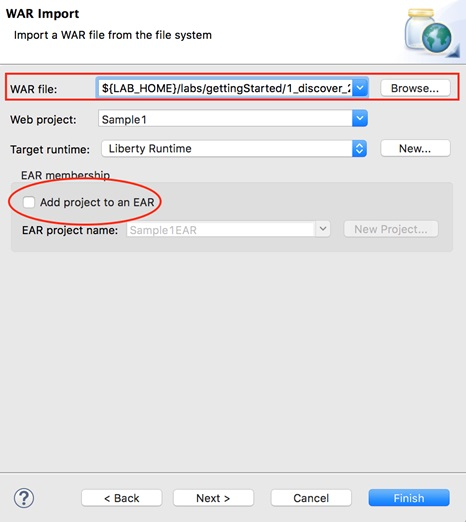
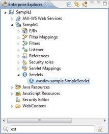
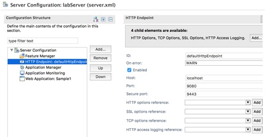
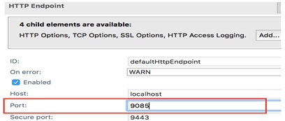
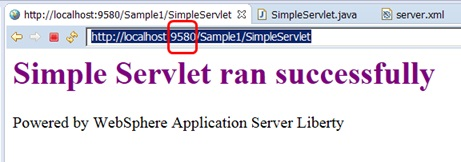
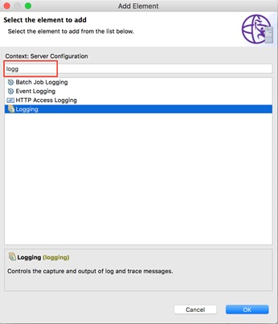
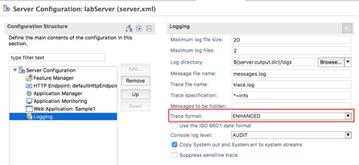

# Discover Liberty

In this lab we will perform the initial set up required for all the labs and explore Liberty.  
The instructions assume a Windows environment, but Linux and Mac differences are presented.  
Where applicable, substitute with Linux or Mac equivalent, such as path names.

Note: 
-	To explore Liberty via WDT, proceed to section 2.
-	To explore Liberty via command line, proceed to section 3.


If you are participating in this lab as part of Liberty Virtual Proof of Technology (Liberty Virtual POT),  you would download a zip file that contains Liberty, Eclipse, WebSphere Developer tools. After installation, you can find Liberty installed in the following locations:

|Location Ref | OS | Absolute Path |
|-------------|----|---------------|
|{LAB_HOME}  | Windows | C:\WLP_<version> |
|{LAB_HOME}  | Linux, Mac   | ~/WLP_<version> or your choice |

If you are not participating as part of Liberty Virtual POT, you had installed Liberty at a location of your choosing.

## Explore Liberty via WDT

Note: proceed directly to the next section if you only want to use the command line.

### Explore the Liberty Server

1. Start the server in eclipse.
    - From the Servers view, select your labServer instance 
      and click the Start the server button.  
      Alternatively, you can also right-click the server name 
      and choose the Start option from the context menu.
    - Switch to the Console view if necessary. Look at the messages to see how fast your server starts!
   
1. Modify the lab server configuration.
    - In the `Servers` view, double-click on your `labServer` server to open the server `Overview` (or right-click and select `Open` from the context menu).
    - First, expand the `Publishing` section and notice that the server is set to automatically detect and publish changes. Keep this default setting.

    
1. In this exercise, you will be deploying a simple servlet application, so try enabling the servlet feature on this server. On the Overview page, locate the Liberty Server Settings section, and click the Open server configuration link to open the server.xml editor.

    
1. Start by providing a meaningful description for your server, such as `Liberty server for labs`.

    
1. To add a feature, such as `servlet-3.1`, 
go back in the `Configuration Structure` area, and determine
if the `Feature Manager` has already been added to the configuration. 
    - The Feature Manager will already exist in the
     configuration if the Liberty Server configuration already has features defined, such as `jsp-2.3`. 
     Review the Feature Manager settings. 
     In this lab, the `Feature Manager` has already been added to the configuration. 
     Click on “Feature Manager” to view the list of features already configured.

     
1. Click the `Add` button 
1. In the pop-up, type servlet to filter to servlet related features. Then select servlet-3.1. Click OK

     
1. In the `server.xml` editor, switch to the `Source` tab at the bottom to see the XML source for this configuration file. 
You will see that a new `featureManager` element has been added, and that it contains the `servlet-3.1` feature.

     
1. Now you have a server that is configured to use the `servlet-3.1` feature. Click the Save button ( ) to save your changes (or use CTRL+S)
Switch to the `Console` panel at the bottom of the workbench and review the latest messages. These messages are showing that your Liberty server automatically detected the configuration update, processed the feature that you enabled, and is now listening for incoming requests. 
    - You will notice that the server configuration was automatically updated and the feature update was completed very quickly. In this example, it was less than one second.

    
1. Now you are ready to start working with a sample application that uses the Servlet feature.

### Deploying a sample application to Liberty

#### Import a sample application into Eclipse 

1. A simple servlet WAR file has been provided for this exercise; import it into your workbench.
    - In Eclipse, go to `File > Import`. Expand the `Web` section, then select `WAR file`. Click `Next`.

    
    - In the `WAR file` field, select `Browse`. Navigate to `{LAB_HOME}\labs\gettingStarted\1_discover\Sample1.war` and click `Open`. 
    - Ensure the `Target runtime` is set to `WebSphere Application Server Liberty`.  
    - Unselect `Add project to an EAR`
    - Click `Finish`.
    
    - If prompted to open the web perspective, click `Open Perspective`.
    - Now you have a `Sample1` web project in your workspace, you can expand it in the `Enterprise Explorer` view to see the different components of the project.

    
1. Start the sample application.
    - In the `Enterprise Explorer` pane, navigate to the `SimpleServlet.java` as shown below. 
        - `Sample1 -> Java resources -> src -> wasdev.sample -> SimpleServlet.java`
    - Right-click on `SimpleServlet.java`.  Note: If right click on SimpleServlet.class file you will get a `Run As > Run Configuration`, select the java file.
    - From the context menu, select `Run As > Run on Server`.

    
    - In the `Run On Server` dialog, verify that `Choose an existing server` is chosen. 
       - Under `localhost`, select the Liberty Server that you defined earlier. The server should be listed in Started state. 
       - Click `Finish`.

    
    - After a moment, your application will be installed and started. See the Console pane for the corresponding messages. 

    
    - In the main panel of the workbench, a browser also opened, pointing to <http://localhost:9080/Sample1/SimpleServlet>
    - If you receive a 404 the first time, try to refresh the browser once the application is completely deployed and started. 
    - At this point, you should see the rendered HTML content generated by the simple servlet. 

    

#### Modify the Application

1. Open the servlet java source code. 
    - In the `Enterprise Explorer` panel, expand the `Sample1` project, then go to `Sample1 > Servlets.` Double-click the `wasdev.sample.SimpleServlet` entry to open the Java editor for the servlet.

    
    - This is how the SimpleServlet.java source looks in the editor:

    
    - This is a very simple servlet with a `doGet()` method that sends out an HTML snippet string as a response. 
    Your `doGet()` method will look similar to this (some of the HTML tags might be a little different – that is ok).
     ```
    	/**
	 * @see HttpServlet#doGet(HttpServletRequest request, HttpServletResponse response)
	 */
	protected void doGet(HttpServletRequest request, HttpServletResponse response) throws ServletException, IOException {
		response.getWriter().print(
			"<html><h1><font color=green>Simple Servlet ran successfully</font></h1></html>"
			+ <html><Powered by WebSphere Application Server Liberty</html>");
	}
    ```
1. Modify the application and publish the change.
    - In the `doGet()` method, Locate the `<h1>` heading element of the HTML string, and notice that it contains a font tag to set the color to green. 
    Modify this string by changing the text green to purple, so your font tag will look read `<font color=purple>`.
    ```
    	response.getWriter().print(
			"<html><h1><font color=purple>Simple Servlet ran successfully</font></html>"
			+ "<html>Powered by WebSphere Application Server Liberty</html>");
    ```
    - Save your changes to the Java source file by either clicking the `Save` button  or using `CTRL+S`.
    - Recall that your server configuration is setup to automatically detect and publish application changes immediately. By saving the changes to your Java source file, you automatically triggered an application update on the server. 
    - To see this, go to the Console view at the bottom of the workbench. The application update started almost immediately after you saved the change to the application,and the update completed in seconds.

    
1. Access the updated application.
    - Refresh the browser in your workbench to see the application change. The title should now be rendered in purple text.

    
    - Optionally continue to play around with application modifications and see how quickly those changes are available in the deployed application. 
    Maybe put in some additional text to display on the page, or add extra HTML tags to see formatting changes (you could add a title tag to set the text displayed in the browser title bar, for example, `<head><title>Liberty Server</title></head>)`.
    - The key is that this edit / publish / debug cycle is very simple and fast! 

#### Modify the server HTTP(s) ports

1. Open the server configuration editor.
    - In the `Servers` view, double-click on the labServer `Server Configuration` to server.xml editor.

    
    - Ensure you are in the Design mode by selecting the `Design` tab on the Server Configuration editor. 
    - Select the `Web Application: Sample1` item in the `Server Configuration` and look at its configuration details. From here, you can set basic application parameters, including the context root for the application.

    
    - Select the `Application Monitoring` item in the `Server Configuration` and look at its configuration details. 
    You can see that the monitor polls for changes every 500ms using an mbean trigger. 
    You did not add any JMX features to your server to support mbean notification – so how is that working?

    
    - Select the `Feature Manager` item to see the features that are configured on your server. 
    You added the `servlet-3.1` feature because you knew that you were going to be running a servlet application. 
    But the development tools automatically added the `localConnector-1.0`. feature to your server to support notifications and application updates. 
    In fact, you would not have needed to add the servlet feature to your server at the beginning at all. 
    The tools would have automatically enabled that feature, based on the content of the application.

    
1. Change the HTTP port.
    - Using the default HTTP port (9080) is an easy way to quickly bring up an application, but it is common to want to use a different port. This is an easy thing to change.
    - In the `Configuration Structure` area, select `Server Configuration`, then select `HTTP Endpoint` 

    
    - In the `HTTP Endpoint Details` area, Change the `HTTP Port` to `9580`.   
        - Update the `Port` field to `9580`.

    
    - Save your changes to the server configuration (`CTRL+S`)
    - You can review your full server configuration in the `server.xml` source file. Back in the server configuration editor, switch to the `Source` tab at the bottom to view the full XML source for your server configuration.

    
    - After you saved your configuration changes, the configuration of your running server was automatically updated. The `Console` pane will show that the Sample1 servlet is now available on port `9580`.

    
    - Now, you can access your sample application using the new port. In the browser in your workbench, change the port from `9080` to `9580` and refresh the application

    

#### Add INFO logging output to console

By default, the Liberty Server has the console log level set to `AUDIT`. 
In this section, you will change the level of log messages written to the console from AUDIT to INFO.

You will perform this activity in the server.xml file using the UI. 
It is also possible to set default logging options in the bootstrap.properties file. 
If the logging options are set in the bootstrap.properties file, 
the logging options will take effect very early in server startup, so it may be useful for debugging server initialization problems. 

1. Open the server configuration editor.
    - In the Servers view, double-click on the `labServer Server Configuration` to open the configuration server.xml editor.

    
    - Ensure you are in the `Design` mode by selecting the `Design` tab on the Server Configuration editor. 
1. Add the Logging configuration option to the server
    - Under the `Configuration Structure` section, Click on `Server Configuration`. And, then click the `Add` button. 

    
    - On the `Add Element` dialog, select `Logging`, then click the `OK` button. 

    
    - he logging page displays the properties for the logging configuration, such as the name of the log files, the maximum size of log files, and the maximum number of log files to retain. Additional configuration information is displayed regarding tracing.  Notice that the Console Log Level is set to `AUDIT` by default. 

    
    - Change the Console log level to `INFO` using the pull down menu. 

    
    - Switch to the Source view for the server.xml file to see the configuration changes added to server.xml. 
    ```
    <logging consoleLogLevel="INFO"/>
    ```
    - Save the configuration file. 	The changes you made are dynamic and take effect immediately. 


    

#### Update trace specification