# Discover Liberty

In this lab we will perform the initial set up required for all the labs and explore Liberty.  
The instructions assume a Windows environment, but Linux and Mac differences are presented.  
Where applicable, substitute with Linux or Mac equivalent, such as path names.

Note: 
-	To explore Liberty via WDT, proceed to section 2.
-	To explore Liberty via command line, proceed to section 3.


If you are participating in this lab as part of Liberty Virtual Proof of Technology (Liberty Virtual POT),  you would download a zip file that contains Liberty, Eclipse, WebSphere Developer tools. After installation, you can find Liberty installed in the following locations:

|Location Ref | OS | Absolute Path |
|-------------|----|---------------|
|{LAB_HOME}  | Windows | C:\WLP_<version> |
|{LAB_HOME}  | Linux, Mac   | ~/WLP_<version> or your choice |

If you are not participating as part of Liberty Virtual POT, you had installed Liberty at a location of your choosing.

## Explore Liberty via WDT

Note: proceed directly to the next section if you only want to use the command line.

### Explore the Liberty Server

1. Start the server in eclipse.
    - From the Servers view, select your labServer instance 
      and click the Start the server button.  
      Alternatively, you can also right-click the server name 
      and choose the Start option from the context menu.
    - Switch to the Console view if necessary. Look at the messages to see how fast your server starts!
   
1. Modify the lab server configuration.
    - In the `Servers` view, double-click on your `labServer` server to open the server `Overview` (or right-click and select `Open` from the context menu).
    - First, expand the `Publishing` section and notice that the server is set to automatically detect and publish changes. Keep this default setting.

    
1. In this exercise, you will be deploying a simple servlet application, so try enabling the servlet feature on this server. On the Overview page, locate the Liberty Server Settings section, and click the Open server configuration link to open the server.xml editor.

    
1. Start by providing a meaningful description for your server, such as `Liberty server for labs`.

    
1. To add a feature, such as `servlet-3.1`, 
go back in the `Configuration Structure` area, and determine
if the `Feature Manager` has already been added to the configuration. 
    - The Feature Manager will already exist in the
     configuration if the Liberty Server configuration already has features defined, such as `jsp-2.3`. 
     Review the Feature Manager settings. 
     In this lab, the `Feature Manager` has already been added to the configuration. 
     Click on “Feature Manager” to view the list of features already configured.

     
1. Click the `Add` button 
1. In the pop-up, type servlet to filter to servlet related features. Then select servlet-3.1. Click OK

     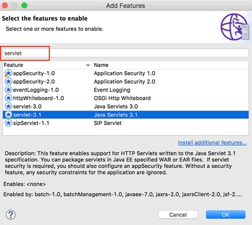
1. In the `server.xml` editor, switch to the `Source` tab at the bottom to see the XML source for this configuration file. 
You will see that a new `featureManager` element has been added, and that it contains the `servlet-3.1` feature.

     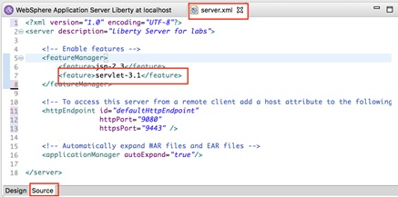
1. Now you have a server that is configured to use the `servlet-3.1` feature. Click the Save button ( ) to save your changes (or use CTRL+S)
Switch to the `Console` panel at the bottom of the workbench and review the latest messages. These messages are showing that your Liberty server automatically detected the configuration update, processed the feature that you enabled, and is now listening for incoming requests. 
    - You will notice that the server configuration was automatically updated and the feature update was completed very quickly. In this example, it was less than one second.

    
1. Now you are ready to start working with a sample application that uses the Servlet feature.

### Deploying a sample application to Liberty

#### Import a sample application into Eclipse 

1. A simple servlet WAR file has been provided for this exercise; import it into your workbench.
    - In Eclipse, go to `File > Import`. Expand the `Web` section, then select `WAR file`. Click `Next`.

    
    - In the `WAR file` field, select `Browse`. Navigate to `{LAB_HOME}\labs\gettingStarted\1_discover\Sample1.war` and click `Open`. 
    - Ensure the `Target runtime` is set to `WebSphere Application Server Liberty`.  
    - Unselect `Add project to an EAR`
    - Click `Finish`.
    
    - If prompted to open the web perspective, click `Open Perspective`.
    - Now you have a `Sample1` web project in your workspace, you can expand it in the `Enterprise Explorer` view to see the different components of the project.

    
1. Start the sample application.
    - In the `Enterprise Explorer` pane, navigate to the `SimpleServlet.java` as shown below. 
        - `Sample1 -> Java resources -> src -> wasdev.sample -> SimpleServlet.java`
    - Right-click on `SimpleServlet.java`.  Note: If right click on SimpleServlet.class file you will get a `Run As > Run Configuration`, select the java file.
    - From the context menu, select `Run As > Run on Server`.

    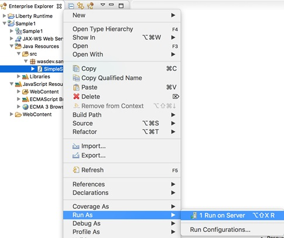
    - In the `Run On Server` dialog, verify that `Choose an existing server` is chosen. 
       - Under `localhost`, select the Liberty Server that you defined earlier. The server should be listed in Started state. 
       - Click `Finish`.

    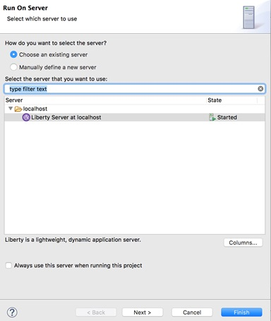
    - After a moment, your application will be installed and started. See the Console pane for the corresponding messages. 

    
    - In the main panel of the workbench, a browser also opened, pointing to <http://localhost:9080/Sample1/SimpleServlet>
    - If you receive a 404 the first time, try to refresh the browser once the application is completely deployed and started. 
    - At this point, you should see the rendered HTML content generated by the simple servlet. 

    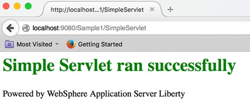

#### Modify the Application

1. Open the servlet java source code. 
    - In the `Enterprise Explorer` panel, expand the `Sample1` project, then go to `Sample1 > Servlets.` Double-click the `wasdev.sample.SimpleServlet` entry to open the Java editor for the servlet.

    
    - This is how the SimpleServlet.java source looks in the editor:

    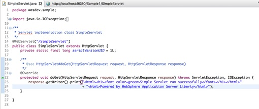
    - This is a very simple servlet with a `doGet()` method that sends out an HTML snippet string as a response. 
    Your `doGet()` method will look similar to this (some of the HTML tags might be a little different – that is ok).
     ```
    	/**
	 * @see HttpServlet#doGet(HttpServletRequest request, HttpServletResponse response)
	 */
	protected void doGet(HttpServletRequest request, HttpServletResponse response) throws ServletException, IOException {
		response.getWriter().print(
			"<html><h1><font color=green>Simple Servlet ran successfully</font></h1></html>"
			+ <html><Powered by WebSphere Application Server Liberty</html>");
	}
    ```
1. Modify the application and publish the change.
    - In the `doGet()` method, Locate the `<h1>` heading element of the HTML string, and notice that it contains a font tag to set the color to green. 
    Modify this string by changing the text green to purple, so your font tag will look read `<font color=purple>`.
    ```
    	response.getWriter().print(
			"<html><h1><font color=purple>Simple Servlet ran successfully</font></html>"
			+ "<html>Powered by WebSphere Application Server Liberty</html>");
    ```
    - Save your changes to the Java source file by either clicking the `Save` button  or using `CTRL+S`.
    - Recall that your server configuration is setup to automatically detect and publish application changes immediately. By saving the changes to your Java source file, you automatically triggered an application update on the server. 
    - To see this, go to the Console view at the bottom of the workbench. The application update started almost immediately after you saved the change to the application,and the update completed in seconds.

    
1. Access the updated application.
    - Refresh the browser in your workbench to see the application change. The title should now be rendered in purple text.

    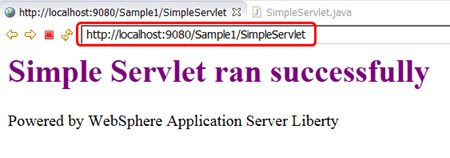
    - Optionally continue to play around with application modifications and see how quickly those changes are available in the deployed application. 
    Maybe put in some additional text to display on the page, or add extra HTML tags to see formatting changes (you could add a title tag to set the text displayed in the browser title bar, for example, `<head><title>Liberty Server</title></head>)`.
    - The key is that this edit / publish / debug cycle is very simple and fast! 

#### Modify the server HTTP(s) ports

1. Open the server configuration editor.
    - In the `Servers` view, double-click on the labServer `Server Configuration` to server.xml editor.

    
    - Ensure you are in the Design mode by selecting the `Design` tab on the Server Configuration editor. 
    - Select the `Web Application: Sample1` item in the `Server Configuration` and look at its configuration details. From here, you can set basic application parameters, including the context root for the application.

    
    - Select the `Application Monitoring` item in the `Server Configuration` and look at its configuration details. 
    You can see that the monitor polls for changes every 500ms using an mbean trigger. 
    You did not add any JMX features to your server to support mbean notification – so how is that working?

    
    - Select the `Feature Manager` item to see the features that are configured on your server. 
    You added the `servlet-3.1` feature because you knew that you were going to be running a servlet application. 
    But the development tools automatically added the `localConnector-1.0`. feature to your server to support notifications and application updates. 
    In fact, you would not have needed to add the servlet feature to your server at the beginning at all. 
    The tools would have automatically enabled that feature, based on the content of the application.

    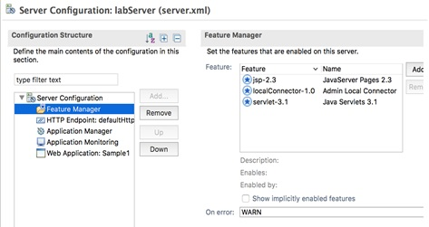
1. Change the HTTP port.
    - Using the default HTTP port (9080) is an easy way to quickly bring up an application, but it is common to want to use a different port. This is an easy thing to change.
    - In the `Configuration Structure` area, select `Server Configuration`, then select `HTTP Endpoint` 

    
    - In the `HTTP Endpoint Details` area, Change the `HTTP Port` to `9580`.   
        - Update the `Port` field to `9580`.

    
    - Save your changes to the server configuration (`CTRL+S`)
    - You can review your full server configuration in the `server.xml` source file. Back in the server configuration editor, switch to the `Source` tab at the bottom to view the full XML source for your server configuration.

    
    - After you saved your configuration changes, the configuration of your running server was automatically updated. The `Console` pane will show that the Sample1 servlet is now available on port `9580`.

    
    - Now, you can access your sample application using the new port. In the browser in your workbench, change the port from `9080` to `9580` and refresh the application

    

#### Add INFO logging output to console

By default, the Liberty Server has the console log level set to `AUDIT`. 
In this section, you will change the level of log messages written to the console from AUDIT to INFO.

You will perform this activity in the server.xml file using the UI. 
It is also possible to set default logging options in the bootstrap.properties file. 
If the logging options are set in the bootstrap.properties file, 
the logging options will take effect very early in server startup, so it may be useful for debugging server initialization problems. 

1. Open the server configuration editor.
    - In the Servers view, double-click on the `labServer Server Configuration` to open the configuration server.xml editor.

    
    - Ensure you are in the `Design` mode by selecting the `Design` tab on the Server Configuration editor. 
1. Add the Logging configuration option to the server
    - Under the `Configuration Structure` section, Click on `Server Configuration`. And, then click the `Add` button. 

    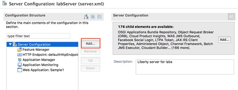
    - On the `Add Element` dialog, select `Logging`, then click the `OK` button. 

    
    - he logging page displays the properties for the logging configuration, such as the name of the log files, the maximum size of log files, and the maximum number of log files to retain. Additional configuration information is displayed regarding tracing.  Notice that the Console Log Level is set to `AUDIT` by default. 

    
    - Change the Console log level to `INFO` using the pull down menu. 

    
    - Switch to the Source view for the server.xml file to see the configuration changes added to server.xml. 
    ```
    <logging consoleLogLevel="INFO"/>
    ```
    - Save the configuration file. 	The changes you made are dynamic and take effect immediately. 


    

#### Update trace specification

By default, the Liberty Server trace specification is set to `*=info=enabled`. 
This is the same for Traditional WAS. 

Updating the trace specification for debugging is easily performed using the server configuration editor. 
You can specify the trace specification in the UI, or copy / paste the trace specification directly into the server.xml file. 
In this section, you will specify a trace specification using the configuration editor. And, then, you will look at the result in the server.xml source file

1. Open the server configuration editor, if it is not already opened. 
    - In the Servers view, double-click on the `Server Configuration` to open the editor for server.xml.

    
    - Ensure you are in the Design mode by selecting the `Design` tab on the Server Configuration editor. 
1. Update the Trace Specification under the logging configuration.
    - Click on `Logging` under the `Server Configuration` section.  This displays the logging and trace details. 
    - Update the `Trace Specification` field with the following trace string: `webcontainer=all=enabled:*=info=enabled `

    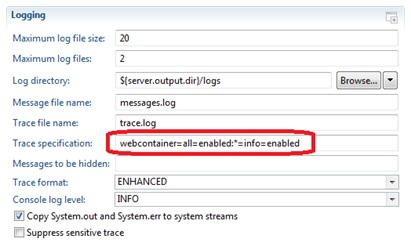
    - Switch to the `Source` tab on the configuration editor and view the logging configuration: `<logging traceSpecification="webcontainer=all=enabled:*=info=enabled"/>`
    - Save the configuration changes.  
    - Check the console view

    
1. Verify that the `trace.log` file contains trace data. 
    - From a Windows Explorer, navigate to the server logs directory: `{LAB_HOME}\wlp\usr\servers\labServer\logs`
    - The `trace.log` file has been created and contains content. 

    
    - You can view the `trace.log` file using an editor such as Notepad.
    - You can also view the trace file in Eclipse.  
    In the `Enterprise Explorer` view, expand the `WebSphere Application Server Liberty` project, and its subdirectories, and you will find the `trace.log` file in the `logs` directory.  
    You may need to right-click on a higher directory and select ‘refresh’ to see any newly-created directories and files.

    
1. *Very importantly*, reset the trace specification back to the default value. 
    - Switch to the `Source` tab on the configuration editor and update the logging configuration to:

    
    - `Save` the configuration.

#### Customize JVM Options

The generic JVM arguments are used to configure and adjust how the JVM executes. 

The WebSphere Application Server Liberty is pre-configured with minimal settings defined. 
The following steps will direct you how to define custom generic JVM arguments such as heap settings for a Liberty server. 


1. In the eclipse Servers view, right-click on the localhost server.  And, then select `New -> Server Environment File -> jvm.options` from the context menu.

    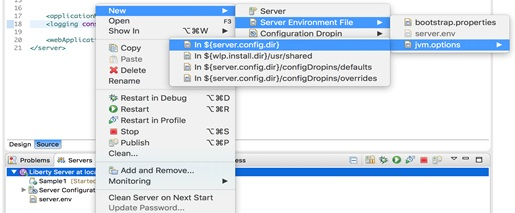
    This will create a `jvm.options` file in the server’s configuration directory with the most commonly-used options available in comments:

    
2. If necessary, double click to open the file in the eclipse text editor
3. Enter the following two lines in the `jvm.options` file to set the minimum and maximum heap size for the labServer server. 
The following options will set the min / max JVM heap size to 25 MB and 500 MB respectively. 
```
-Xms25m
-Xmx500m
```
4. Save the file:  `Ctrl + S`


TIP: 

- The default maximum heap size values of the JVM heap size is:` –Xmx1024m`
- VerboseGC can be enabled by specifying `-verbose:gc` in the jvm.options file. 
- Verbose GC output will be logged to the following location by default:
`<wlp.install.dir>/usr/servers/<serverName>/logs/console.log`
- Depending on your preferences, you might configure a single JVM or all Liberty JVMs with your options file. 
To apply these settings to all Liberty Servers, save `jvm.options` at:
`${wlp.install.dir}/etc/jvm.options`

TIP: For this lab, the `${wlp.install.dir}` is `{LAB_HOME}\wlp`

The changes will take effect for all JVMs that do not have a locally defined `jvm.options` file.
Restart the server to enable changes.

This concludes the customization portion of the lab. In the next sections, you will be introduced to the Liberty configuration files for customizing the server initialization and environment settings. 

## Explore Liberty Via Command Line

### Exploring the Liberty Server from command line

1. Create and start the server
    - cd `{LAB_HOME}/wlp/bin`
    - server create myServer
    - server start myServer
1. Modify the server configuration.
    - Open an editor to edit `{LAB_HOME}/wlp/usr/servers/myServer/server.xml`
    - Under the feature manager, replace existing featured with `servlet-3.1` feature:
 ```
<featureManager>
     <feature>servlet-3.1</feature>
</featureManager>
```
    - Optionally change the server description to something meaningful, such as `Liberty server for labs`: `<server description="Libert server for labs">`
    - Save the changes
    - Look at the tail of `{LAB_HOME}/wlp/usr/servers/myServer/logs/message.log`. You should see messages about feature updates. For example,
```
[4/16/19 14:29:29:276 CDT] 00000037 com.ibm.ws.kernel.feature.internal.FeatureManager            I CWWKF0007I: Feature update started.
[4/16/19 14:29:29:400 CDT] 00000035 com.ibm.ws.config.xml.internal.ConfigRefresher               A CWWKG0017I: The server configuration was successfully updated in 0.240 seconds.
```

Now you are ready to start working with a sample application that uses the Servlet feature.
 
### Deploying a sample application to Liberty

#### Deploy an application to dropins directory

1. The easiest way to deploy an application to Liberty is to copy it to the server’s `dropins` directory.
    - Copy the provided application at `{LAB_HOME}/labs/gettingStarted/1_discover/Sample1.war` to `{LAB_HOME}/wlp/usr/servers/myServers/dropins` directory
    - Check the server’s `messages.log` to ensure that application deployment has taken place:
```
[4/16/19 14:41:10:496 CDT] 00000066 com.ibm.ws.app.manager.AppMessageHelper                      I CWWKZ0018I: Starting application Sample1.
[4/16/19 14:41:10:812 CDT] 00000066 com.ibm.ws.session.WASSessionCore                            I SESN8501I: The session manager did not find a persistent storage location; HttpSession objects will be stored in the local application server's memory.
[4/16/19 14:41:10:828 CDT] 00000066 com.ibm.ws.webcontainer.osgi.webapp.WebGroup                 I SRVE0169I: Loading Web Module: Sample1.
[4/16/19 14:41:10:828 CDT] 00000066 com.ibm.ws.webcontainer                                      I SRVE0250I: Web Module Sample1 has been bound to default_host.
[4/16/19 14:41:10:828 CDT] 00000066 com.ibm.ws.http.internal.VirtualHostImpl                     A CWWKT0016I: Web application available (default_host): http://localhost:9080/Sample1/
[4/16/19 14:41:10:843 CDT] 00000066 com.ibm.ws.app.manager.AppMessageHelper                      A CWWKZ0001I: Application Sample1 started in 0.347 seconds.
[4/16/19 14:41:11:044 CDT] 0000003b com.ibm.ws.webcontainer.osgi.mbeans.PluginGenerator          I SRVE9103I: A configuration file for a web server plugin was automatically generated for this server at C:\Users\MichaelCheng\Documents\workshops\VirtualPOT\LibertyPoT_19.0.0.3\WLP_19.0.0.3\wlp\usr\servers\myServer\logs\state\plugin-cfg.xml.
[4/16/19 14:41:11:059 CDT] 00000058 com.ibm.ws.session.WASSessionCore                            I SESN0176I: A new session context will be created for application key default_host/Sample1
[4/16/19 14:41:11:082 CDT] 00000058 com.ibm.ws.util                                              I SESN0172I: The session manager is using the Java default SecureRandom implementation for session ID generation. 
```
    - check the application is running by opening a browser at: `http://localhost:9080/Sample1/SimpleServlet`
    - Delete the application from the `dropins` directory, then check that it’s no longer accessible from the browser. 

#### Deploy the application to the apps directory

1. Copy the application `Sample1.war` into the server’s `apps` directory
1. Edit `server.xml` and add the following line:
```
<webApplication id="Sample1" location="Sample1.war" name="Sample1" />
```
3. Check the server’s `message.log` that the application is started.
4. check the application is running by opening a browser at: <http://localhost:9080/Sample1/SimpleServlet>

#### Modify the server HTTP(s) ports

1. Edit server.xml and change
```
httpPort="9080"
```
to
```
httpPort="9580"
```
 
2. Save the changes, check the logs, then open a browser to: <http://localhost:9580/Sample1/SimpleServlet>

#### Add INFO logging output to console

By default, the Liberty Server has the console log level set to `AUDIT`. In this section, you will change the level of log messages written to the console from AUDIT to INFO. 

You will perform this activity by modifying server.xml file using an editor. It is also possible to set default logging options in the `bootstrap.properties` file. 
If the logging options are set in the `bootstrap.properties` file, the logging options will take effect very early in server startup, 
so it may be useful for debugging server initialization problems. 

3. Edit `server.xml` and add the following line:
```
<logging consoleLogLevel="INFO"/>
```
4. Save the changes, and check `messages.log` that the configuration change was updated.


#### Update trace specification

By default, the Liberty Server trace specification is set to `*=info=enabled`. This is the same for Traditional WAS. 
Updating the trace specification for debugging is easily performed by updating server.xml.

1. Edit `server.xml` and update the logging stanza to:
```
 <logging consoleLogLevel="INFO"    traceSpecification="webcontainer=all=enabled:*=info=enabled" />
 ```
1. Verify that the trace file contains trace data. The trace file is located at:
`{LAB_HOME}\wlp\usr\servers\myServer\logs\trace.log`
1. Check new entries are added to `trace.log` after you refresh the browser or point your browser to  the application at: <http://localhost:9580/Sample1/SimpleServlet>
1. Very important: avoid excessive tracing by reverting the trace specification back to :  `<logging consoleLogLevel="INFO"/>`
1. Save the changes.


#### Customizing Liberty JVM Options

The generic JVM arguments are used to configure and adjust how the JVM executes. 

The WebSphere Application Server Liberty is pre-configured with minimal settings defined. 
The following steps will direct you how to define custom generic JVM arguments such as heap settings for a Liberty server. 
1.  Create a `jvm.options` file that affects all servers
    - Change directory to `{LAB_HOME}/wlp/usr/servers/myServer`
    - Create a new file name `jvm.options`, and add the following lines to set the minimum and maximum heap size. The following options will set the min / max JVM heap size to 25 MB and 500 MB respectively. 
```
-Xms25m
-Xmx500m
```
2. Save the file and restart the server


TIP: 
- The default maximum heap size values of the JVM heap size is: `–Xmx1024m`
- VerboseGC can be enabled by specifying `-verbose:gc` in the `jvm.options` file. 
- Verbose GC output will be logged to the following location by default:
`<wlp.install.dir>/usr/servers/<serverName>/logs/console.log`
- Depending on your preferences, you might configure a single JVM or all Liberty JVMs with your options file. 
To apply these settings to all Liberty Servers, save `jvm.options` at:
`${wlp.install.dir}/etc/jvm.options`

TIP: For this lab, the `${wlp.install.dir}` is `{LAB_HOME}\wlp`

The changes will take effect for all JVMs that do not have a locally defined `jvm.options` file.
Restart the server to enable changes.

This concludes the customization portion of the lab using command line. In the next sections, you will be introduced to the Liberty configuration files for customizing the server initialization and environment settings. 


## Introducing Liberty Environment Variable Configuration

You can customize the Liberty environment using certain specific variables to support the placement of product binaries and shared resources.

The Liberty environment variables are specified using `server.env` file. 
You can use `server.env` file at the installation and server levels to specify environment variables such as `JAVA_HOME`, `WLP_USER_DIR` and `WLP_OUTPUT_DIR`. 

NOTE: You will not modify the default environment configuration in this lab. 

Review the information in this section to become familiar with the environment variables that are available for customizing the Liberty environment. 
The following Liberty specific variables can be used to customize the Liberty environment:
- `${wlp.install.dir}`

   This configuration variable has an inferred location. The installation directory is always set to the parent of the directory containing the launch script or the parent of the /lib directory containing the target jar files.

    TIP: For this lab, the `${wlp.install.dir}` is `{LAB_HOME}\wlp`

- `WLP_USER_DIR`

    This environment variable can be used to specify an alternate location for the `${wlp.install.dir}/usr. 
    This variable can only be an absolute path. 
    If this is specified, the runtime environment looks for shared resources and server definition in the specified directory. 

    The `${server.config.dir}` is equivalent to `${wlp.user.dir}/servers/serverName` and can be set to a different location when running a server (to use configuration files from a location outside `wlp.user.dir)`.

    TIP: For this lab, the `${server.config.dir}` is `{LAB_HOME}\wlp\usr\servers\labServer`

- `WLP_OUTPUT_DIR`

    This environment variable can be used to specify an alternate location for server generated output such as logs, the workarea directory and generated files. This variable can only be an absolute path. 

    If this environment variable is specified, `${server.output.dir}` is set to the equivalent of `WLP_OUTPUT_DIR/serverName`. If not specified, the `${server.output.dir}` is the same as `${server.config.dir}` .

    TIP: For this lab, the `${server.output.dir}` is `{LAB_HOME}\wlp\usr\servers\labServer`, which is the same as `${server.config.dir}`.

 
## Introducing Liberty bootstrap.properties

In this section of the lab, you will gain an understanding of how and when bootstrap properties are required during environment initialization. 

*NOTE*: You will not modify any of the default environment initialization. This information is provided in the lab for your reference.  

Bootstrap properties are used to initialize the runtime environment for a particular server. 
Generally, they are attributes that affect the configuration and initialization of the runtime.

Bootstrap properties are set in a text file named `bootstrap.properties`. This file should be located in the server directory alongside the configuration root file `server.xml`. 

By default, the server directory is `usr/servers/server_name`.
The bootstrap.properties file contains two types of properties: 
- A small, predefined set of initialization properties.
- Any custom properties you choose to define which you can then use as variables in other configuration files (that is, server.xml and included files).

You can create the `bootstrap.properties` through any file creation mechanism, or by using the same method shown above for creation of the `jvm.options` file in eclipse.  

You can edit the `bootstrap.properties` file using a text editor, or using the editor that is part of the Liberty developer tools. 
Changes to the bootstrap.properties file are applied when the server is restarted.

*TIP:* 
As an example, the logging service can be controlled through the server configuration (`server.xml`) file. Occasionally you need to set logging properties so they can take effect before the server configuration files are processed.
In this case you set them in the bootstrap.properties file instead of the server configuration. 
You do not usually need to do this to get logging from your own code, which is loaded after server configuration processing, but you might need to do this to analyze problems in early server start or configuration processing.
 
