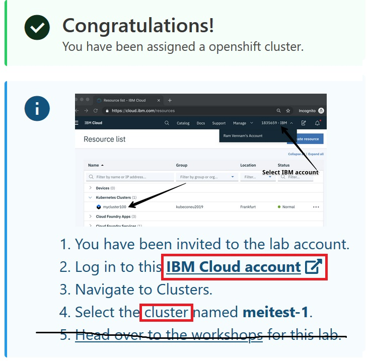
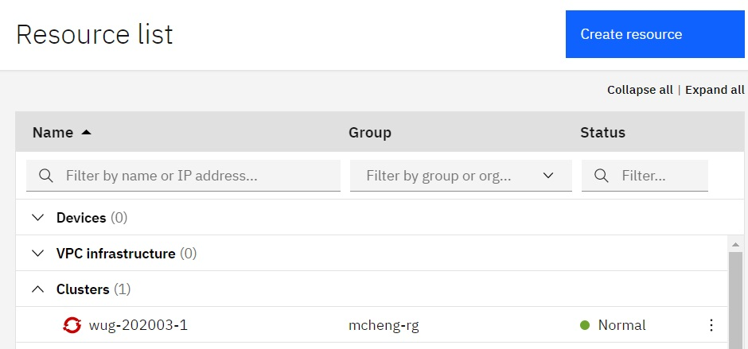
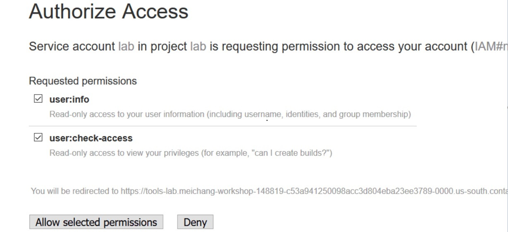

# Workshop Lab Setup

This section contains instructions to access Openshift Clusters for those workshops that use IBM public cloud

## Create a free IBM Cloud Account ID

If you don't already have an IBM Cloud Account ID, point your browser to https://cloud.ibm.com and select `Create an IBM Cloud account`. You may use any email, including personal email. No credit card needed.

Note: You may optionally deactivate your account after the lab. 
However, we encourage you to keep your account for future labs. 
After deactivation, you will need to contact IBM Support to reactivate it. 
If you insist on deactivation, follow the instructions on the support page for "lite account": https://www.ibm.com/support/pages/how-can-you-cancel-your-ibm-cloud-account.

## Cluster assignment

- You will be given a URL specific to your workshop, and a lab key. 
Point your browser to the URL. 
Enter the key for your workshop and your IBM ID to get assigned a cluster.


- After sumitting successfully, the Congratuations page similar to the following is displayed:





- From the page, note about your assigned cluster name and ignore the bullet 5 which is not used in this workshop.
- Login to the link **IBM Cloud account** with your IBM ID.
- Ensure that the account selected is `2044184 - CP4AWorkshops`


- Navigate to IBM CLoud > Resource list


- Expand `clusters` and click on your cluster



- Click `Openshift Web Console` to get access to the console for your cluster.
- Ignore the `IBM Cloud Shell` button for now. It gives you a command line terminal to interact with IBM cloud, and may be used for a future lab.
 


## Access the web terminal

The web terminal runs in your Openshift cluster.
It gives you command line access to many tools you will use for the labs. 
To access the web terminal:

- From the OpenShift web console, navigate to Networking -> Routes.  
- On the right, from the top, select Project name **lab** and 
- from the route **tools**, click on the URL under "Location".  


- Click on `Log in with OpenShift`


- Click on `Allow selected permissions`



- Note: The authorization permission page above may not display again in the subsequent access.  
The information will already be in the browser cookie cache.

- The web terminal is displayed:


## Clone the Workshop 

From within the web terminal, run the following `git` command to downloand the repository for labs:

```
git clone https://github.com/IBM/openshift-workshop-was.git
```

The contents for the labs are under the the directory `openshift-workshop-was/labs`. You can access files required for your labs under the lab's directory. For example: 

- Introduction to Containerization: `openshift-workshop-was/labs/Openshift/HelloContainer`
- Introduction to Container Orchestration using Openshift: `openshift-workshop-was/labs/Openshift/IntroOpenshift`

## Next

You've completed the lab setup.  Please follow the link to do the first lab `Introduction to Containerization`:

- [Introduction to Containerization](https://github.com/IBM/openshift-workshop-was/tree/master/labs/Openshift/HelloContainer)


